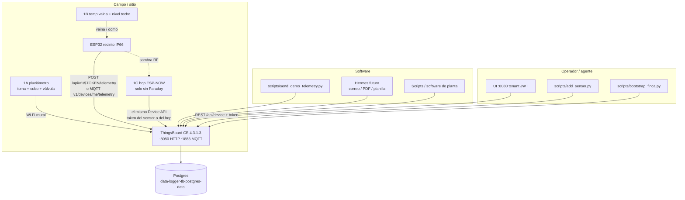
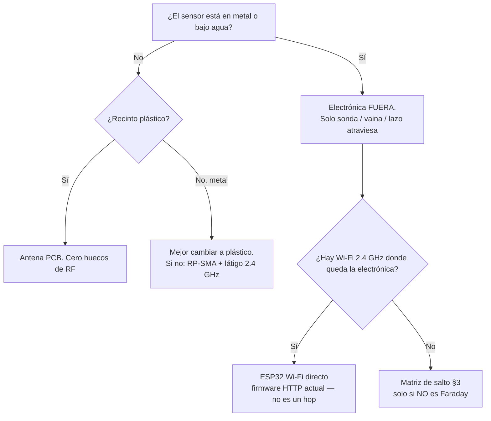
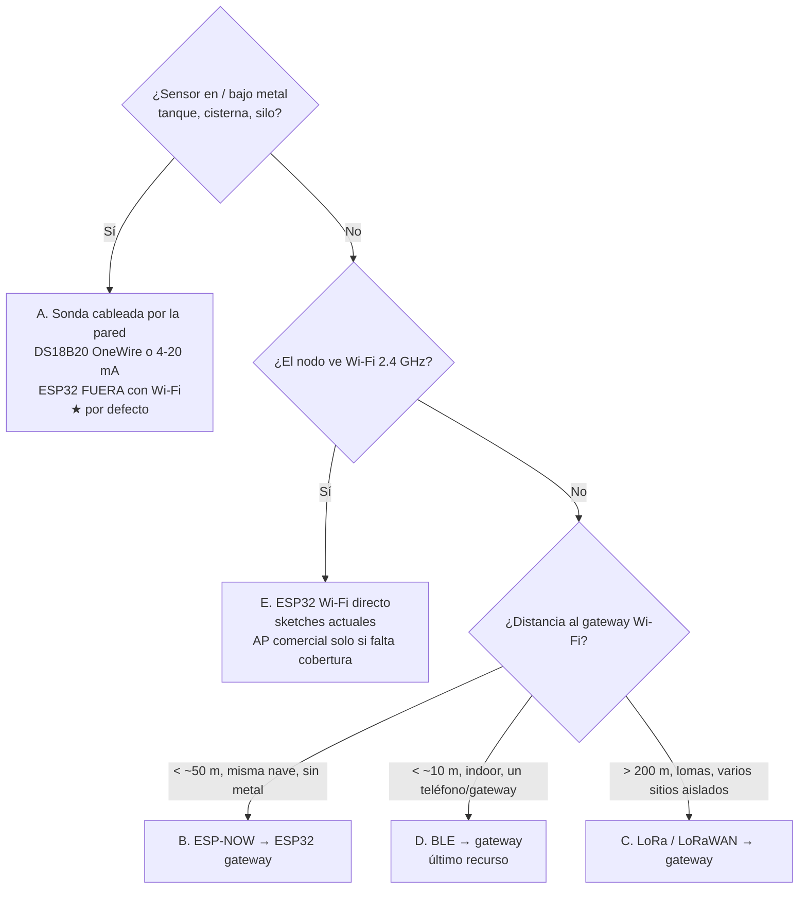
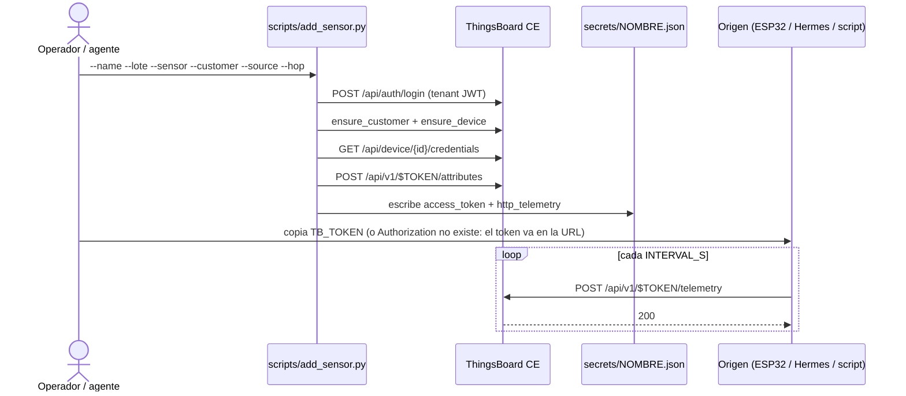
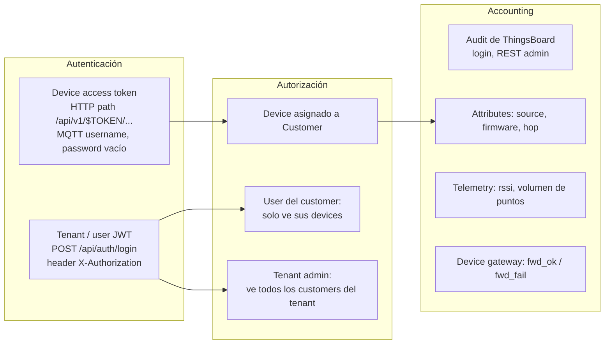
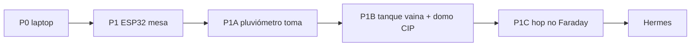

# data-logger — diseño de componente: recinto, salto RF y contrato de ingestión

| Campo | Valor |
|---|---|
| **Título** | data-logger: pluviómetro primero, tanque CIP, hop y contrato de ingestión |
| **Autor** | _por completar_ |
| **Fecha** | 2026-08-18 |
| **Estado** | Draft (rev. 2026-08-18; lote 1A = pluviómetro) |
| **Repo** | [harveybc/data-logger](https://github.com/harveybc/data-logger) (checkout local `/home/harveybc/Documents/GitHub/data-logger`) |
| **Audiencia** | operadores no técnicos, Lugui (fabricación), agentes de código, quien mantiene el puente ThingsBoard |
| **Idioma** | español; identificadores de protocolo, rutas, claves JSON y APIs de ThingsBoard en inglés tal como están en el código |

---

## Overview

`data-logger` no es un servidor IoT: es el **kit-puente** que deja ThingsBoard Community Edition 4.3.1.3 listo para que un operador no técnico vea telemetría de muchos orígenes (ESP32, laptop, Hermes, software de planta) sin escribir backend. El árbol actual ya tiene compose (`docker-compose.yml`), bootstrap (`scripts/bootstrap_finca.py`), registro de dispositivo (`scripts/add_sensor.py`), sensor virtual (`scripts/send_demo_telemetry.py`) y tres sketches HTTP/MQTT en `firmware/`. El Flask + AdminLTE histórico está retirado (`docs/LEGACY.md`) y **no vuelve**.

El **primer hardware de campo no es el tanque**: es un **pluviómetro de acumulación** (lote **1A**). Hoy la lluvia la mide a mano un empleado; a veces se equivoca, a veces miente, a veces no lo hace. El veterinario necesita `rain_mm` fiable para pastos. Hay toma, no hay Faraday, no hay CIP: se fabrica y se flashea primero.

Después: **1B** nivel de leche sin contacto (domo que escurre CIP + store-and-forward) y temperatura por vaina; **1C** hop ESP-NOW solo en sombra RF **sin** Faraday. Un AP/repeater de consumo **se rechaza** como ingestión y como AAA. Ingestión = Device API (`/api/v1/$TOKEN/telemetry`). GitHub mínimo. El Flask + AdminLTE **no vuelve**.

---

## Background & Motivation

### Estado actual (verificado en el checkout)

```
ESP32 / sensor virtual / (más adelante) Hermes
        |  HTTP :8080/api/v1/$TOKEN/telemetry
        |  MQTT :1883  v1/devices/me/telemetry
        v
 ThingsBoard CE  ← UI, dispositivos, dashboards, alarmas, tenants
        |
        v
 PostgreSQL (volumen Docker data-logger-tb-postgres-data)
```

Fuente: `docs/ARQUITECTURA.md`. Postgres **no** se publica en el host 5432 (evita chocar con el OLAP de `predictor`). HTTP 8080 y MQTT 1883 sí, vía `.env`.

Lo que ya funciona:

| Pieza | Dónde | Qué hace |
|---|---|---|
| Plataforma | `docker-compose.yml` (`thingsboard/tb-node:4.3.1.3` + `postgres:18`) | UI, series, tokens, tenants |
| Alta de sitio demo | `scripts/bootstrap_finca.py` | Customer `Finca Demo`, dos devices, `secrets/devices.json` |
| Alta de un sensor | `scripts/add_sensor.py` | Device + token + atributos `finca`/`lote`/`sensor`/`firmware` |
| Sensor virtual | `scripts/send_demo_telemetry.py` | POST `temperature`/`humidity`/`rssi` |
| Firmware | `firmware/esp32_dht22_http`, `esp32_ds18b20_http`, `esp32_dht22_mqtt` | GPIO 4, intervalo 30 s, token en `secrets.h` |
| Contrato Hermes | `hermes/README.md` | Solo el POST HTTP; no hay parser aquí |
| Prompts de agente | `prompts/01`–`04` | Desplegar, flashear, otro customer, diagnosticar |

### Dolores que este diseño ataca

1. **Lluvia a mano.** Un empleado mide el acumulado; el dato alimenta la ración. Sin registro automático no hay auditoría ni serie en ThingsBoard.
2. **Recinto.** Un ESP32 DevKit no sobrevive a manguera ni a CIP de tanque. Lugui fabrica agujeros y cajas; hace falta un contrato (caja única + toma para el pluviómetro; dos cajas + pack para nodos a batería; clase CIP para el tanque).
3. **Tanque + CIP.** El tanque de leche **sí** se lava con ácido/álcali y desinfectante. Nivel **sin contacto** desde el techo; nada mecánico en el producto. Faraday + vapor + espuma.
3. **Orígenes heterogéneos.** El kit ya acepta ESP32 y un script de laptop. Hermes (otro repo) y software de planta tienen que entrar por el **mismo** contrato, no por un Flask nuevo.
4. **AAA casero.** La tentación de “un login propio” es exactamente lo que se retiró en `docs/LEGACY.md`. ThingsBoard CE ya tiene tenants, customers, users, access tokens y auditoría.
5. **GitHub vacío.** Topics en blanco, pestañas Projects / Actions / Wiki / Agents / Security sin uso. Es un side project mientras corren evaluaciones DOIN de varios días: el proceso tiene que ser ligero y útil, no teatro.

### Decisiones ya tomadas (no se reabren)

- ThingsBoard CE es la plataforma; este repo es el puente.
- El Flask + AdminLTE no se restaura.
- Hermes no se implementa aquí; solo el contrato HTTP.
- No arrancar Docker ni tocar procesos GPU/DOIN en la máquina de investigación.
- No publicar el puerto 5432 del host.
- **1A primero:** pluviómetro de acumulación, **toma**, una caja IP66, jabón suave. No es el caso batería.
- Ambiente / hop: lavado = **manguera + jabón suave**. El **nodo de tanque es otra clase** (CIP ácido/álcali + desinfectante).
- Donde no hay toma: **batería primaria**, wake **3600 s**, placa Iq bajo. Donde hay toma: **5 V mural**. XOR pack.
- **1C** par hop ESP-NOW (sombra RF **sin** Faraday). No es el tanque. No es lo primero que se suelda.
- Temperatura de tanque = sonda en **vaina** (A). Nivel de tanque = **no contacto** desde el techo (domo). No se mezclan en un transductor.

---

## Goals & Non-Goals

### Goals

1. Entregar el **pluviómetro 1A** (acumulado diario `rain_mm`, drenaje a las 00:00, BME280, toma) como primer nodo de campo.
2. Contrato mecánico: Hoja Lugui — **caja única + toma** (pluviómetro); dos cajas + pack (batería); **clase CIP + domo** (tanque).
3. **Nivel de tanque 1B:** no contacto, domo que escurre CIP, store-and-forward; temperatura por vaina aparte.
4. RF: rechazar el repeater; hop solo sombra sin Faraday (**1C**, no primero).
5. Contrato de ingestión + AAA = ThingsBoard CE. GitHub mínimo. Kit existente.

### Non-Goals

- Restaurar o reescribir AAA/Flask/AdminLTE.
- Implementar Hermes (parsers de correo/PDF/planillas) en este repo.
- ThingsBoard PE, white-label, facturación, Metabase/OLAP (eso es de `predictor`).
- Compilar firmware en CI (el operador usa Arduino IDE).
- Un servicio Java “ThingsBoard IoT Gateway” de producción; el salto v1 es otro ESP32.
- Rediseñar nombres internos (`bootstrap_finca.py`, customer `Finca Demo`). El README/about de usuario **no** usa “granjero” ni “finca”; no reintroducirlos en `prompts/05` ni en párrafos nuevos del README. Docs imprimibles (`docs/ENCIERRO.md` Hoja) hablan de tanque, recinto y sitio — tampoco «granjero».
- Arrancar compose, flashear placas o tocar GPU en esta máquina como parte del diseño.

---

## Proposed Design

### 1. Arquitectura de referencia

El único plano de ingestión hacia la plataforma es el **Device API** de ThingsBoard. Todo lo demás (sonda, radio local, parser, script) es un **origen** que termina en ese API.



Regla de oro: **un origen nuevo no pide código de servidor**. Se registra el Device, se copia el access token, se POSTea JSON.

### 1.5 Casos de uso del lote (orden de fabricación)

#### 1A — Pluviómetro de acumulación (primero, ahora)

Motivo: dejar de depender de una lectura manual de lluvia. Device `pluviometro-01`.

| Pieza | Decisión |
|---|---|
| Recipiente | Cubo/embudo de **área conocida** (hay que medirla; OQ 10) |
| Nivel | **ToF VL53L1X** bajo la tapa, mirando el agua. Default: no boya. Un ultrasónico JSN-SR04T tiene zona ciega ~20 cm — inútil en un cubo chico. Hidrostático contacta el agua y pelea el fondo con la válvula. ToF corto, tapa seca, sin partes móviles. |
| Drenaje | Electroválvula en el fondo. Driver **MOSFET + diodo flyback**. Típico 12 V (fuente aparte en la misma caja); si Lugui consigue válvula 5–6 V, mejor BOM (OQ 12). |
| Energía | **Toma + adaptador.** Una caja IP66. **No** caja B. DevKit. `INTERVAL_S` de muestreo 15–60 min. |
| Lavado | Manguera + jabón suave. |
| Extra | **BME280** (o clon): `temperature`, `humidity`, `pressure`. Viento **aplazado**. |
| Reloj | 00:00 **hora local** (NTP + huso, OQ 11). |

Ciclo:

1. De día: muestrear `level_mm` cada 15–60 min. `rain_mm = h_mm * (A_cubo / A_embudo)`; si el embudo **es** el cubo, `rain_mm = h_mm`.
2. A las 00:00 local: si hay agua, guardar el acumulado del día (`rain_mm`), abrir válvula, vaciar, confirmar `level_mm` ≈ 0, `POST`, `drain_ok` 0/1, cerrar válvula.

```json
{"rain_mm": 12.4, "level_mm": 0.0, "temperature": 18.1, "humidity": 72.0, "pressure": 1012.3, "drain_ok": 1}
```

Attributes: `source=esp32`, `hop=wifi`, `sensor=pluviometro`.

#### 1B — Tanque de leche: nivel sin contacto + CIP + store-and-forward

Clase de recinto **distinta** (CIP: ácido/álcali + desinfectante). No es el lote de jabón suave.

**Nivel:** distancia desde el **techo** hasta la superficie. **Nada mecánico** (no boya, no varilla). No hidrostático en el producto. No láser ToF barato al chorro CIP.

Forma: **domo pegado al techo que escurre** el CIP (pendiente, sin charco sobre el transductor).

Salida de cable, en este orden:

1. Puerto existente (boca de hombre, tri-clamp libre, puerto CIP no usado).
2. Pasamuros sanitario soldado / clamp **nuevo** solo si no hay puerto.
3. **No** taladrar la chapa a ciegas.

Electrónica: fuera del volumen metálico, **o** en el domo si el domo es **plástico** (el radio puede salir por arriba). Cable de transductor corto.

| Tecnología | Rol |
|---|---|
| **JSN-SR04T** (ultrasónico estanco) en el domo, cara abajo | **Default de ensayo.** Barato. Zona ciega ~20 cm OK en tanque alto. Riesgos: espuma, vapor, condensación, chorro CIP. Mitigación: cúpula que escurre; **no medir durante CIP** (entrada digital o horario). |
| Radar 80 GHz de proceso | Medio plazo lácteo. Aguanta vapor/espuma/CIP. No es el primer euro del 1A. |
| Boya, ToF barato a CIP, hidrostático en leche | **Rechazados.** |

**Store-and-forward** (no Wi‑Fi continuo):

- Cada **15 min** en **dos ventanas de 2 h** (ordeño; horas exactas = OQ 14). Buffer NVS/LittleFS.
- Al terminar cada ventana: Wi‑Fi y subir el lote (`POST` JSON array o N puntos con `ts`).
- Cada **6 h** una lectura de vigilancia (el nivel no debe moverse raro: fuga / extracción).
- Si no hay Wi‑Fi: reintentar. **No borrar el buffer hasta HTTP 200.**

**Temperatura del tanque:** sigue siendo opción A — DS18B20 en **vaina**, radio fuera. **Otro** transductor, otro device o mismo device con otra clave, pero no el sensor de nivel.

#### 1C — Hop ESP-NOW (después de 1A)

Sombra RF **sin** Faraday. Padre mural; hijo batería + 3600 s. **No** es el tanque. **No** es lo primero que se suelda.

### 2. Contrato mecánico / eléctrico (Lugui)

Lugui no es ingeniero de software. Lo que se le entrega es **`docs/ENCIERRO.md` partido en dos**: (1) **Hoja Lugui** — una página, imprimible, sin pines ni `secrets.h`; (2) **Apéndice de firmware** — pines, LDO, ADC, P/N de placa. Esta sección del diseño es la fuente; PR 1 la copia a esos dos archivos. **No** se imprime el diseño completo ni el mermaid al taller.

#### 2.0 Hoja Lugui (una página — esto es lo que se imprime)

Texto de taller. Lugui no necesita el resto del documento.

**Qué fabrica**

1. **Cuántas cajas — según el nodo.**
   - **1A pluviómetro (primero):** **una** caja IP66, toma. Interior ≥ 160 × 110 × 70 mm (DevKit + MOSFET + fuente 12 V de válvula si aplica). **No** caja B.
   - **Ambiente / hop a batería:** **dos** cajas (A electrónica 120 × 80 × 55, B pack). No meter el pack en A.
   - **1B tanque CIP:** recinto **clase CIP** (domo que escurre + electrónica fuera o en domo plástico). No es la caja de jabón suave.
2. **Material 1A / ambiente / hop:** ABS o PC liso + juntas de silicona. Lavado = **manguera + jabón suave**. **1B tanque:** el tanque **sí** tiene CIP (ácido/álcali + desinfectante). El recinto del nivel es el **domo que escurre**; no se declara IP66 de jardín como “aguanta CIP”. **No metal** en 1A (antena PCB).
3. **Tapa servible:** 4 tornillos M3 o M4 inox + junta de silicona en ranura. No pegamento estructural. No “sellado de por vida”. **Prohibido potear** la placa.
4. **Taladros solo en caja A, cara inferior o lateral baja** (nunca en la tapa):

| Hueco | Taladro | Qué pasa | Notas |
|---|---|---|---|
| Prensa **PG7** / **M12×1.5** | Ø ~12.5 mm | 1A: cable ToF/BME280 si van fuera; tanque: vaina | Un cable por prensa |
| Prensa **PG7** extra | Ø ~12.5 mm | **1A: cable de electroválvula** | Fondo del cubo, strain-relief |
| Prensa **PG9** / **M16×1.5** | Ø ~15–16 mm | 5 V mural (pigtail) | Cara baja |
| Tapón ciego M12 | mismo PG7 | Reserva | No dejar abierto |

No compartir sonda y alimentación en el mismo agujero. Junta tórica en cada prensa. Strain-relief interno (brida) para que un tirón no llegue a la placa. **No** taladrar USB a la intemperie (sería IP0). **No** taladrar RP-SMA en el lote 1 (caja plástica).

5. **Montaje de la placa:** firmware entrega una **platina-portadora v1** con 4 huecos M2.5 ya taladrados y la placa atornillada encima. Lugui **no** mide un DevKit ni elige P/N. Atornilla la platina a 4 standoffs M2.5 × 8 mm en el fondo de la caja A, **al rectángulo de esa platina v1**. Ese intereje se anota en el apéndice de `docs/ENCIERRO.md` en cuanto exista la v1 y **queda congelado**: cajas posteriores usan el mismo patrón. Un FireBeetle / D32 / WROOM futuro se atornilla a **otra platina** que conserva esos 4 huecos; **no** se taladran huecos nuevos en la caja A. Muchos DevKit (DevKitC V4, clones DOIT) **no tienen** 4 huecos M2.5: por eso la platina es entrega de firmware, no un taladro de Lugui.
6. **Conector del lote 1 (uno solo a la platina):** hembra **JST-XH 2 pines** polarizada (`5V`, `GND`) en la platina (`VIN`+`GND`). **Un** macho JST a la vez. **No** usar el USB de programación como alimentación de campo. El USB queda **dentro**, accesible al abrir la tapa A, solo para flashear.
7. **Alimentación.**
   - **1A pluviómetro: solo toma.** Adaptador 5 V al ESP (pigtail PG9). Si la válvula es 12 V, fuente 12 V **en la misma caja** (no caja B). MOSFET + flyback en la platina (firmware). Pico ≥ 1 A si hay 12 V.
   - **Hay toma (otros nodos):** mural + pigtail, DevKit, XOR pack.
   - **No hay toma:** pack LiFePO4 always-on, platina Iq bajo, `INTERVAL_S` 3600.
   - **Prohibido:** LiPo bolsa; 1S crudo; mural y pack a la vez; power bank + sleep.
8. **Autonomía:** 1A no aplica (toma). DevKit despierto ~10 h de pack. Meses **solo** Iq bajo + 3600 s. No prometas semanas en DevKit.
9. **Sonda / tanque (default de proceso):** si el tanque ya tiene **vaina termométrica**, la sonda entra en la vaina. **No** taladrar el tanque. **No** poner una cápsula genérica en contacto directo con alimento. Pasamuros 1/4" NPT solo si no hay vaina **y** el líquido no es alimento, o con cápsula/cable con especificación de contacto alimentario. Electrónica **siempre fuera** del metal.
10. **Etiqueta:** **dentro** de la tapa A, `name` del device + últimos 4 caracteres del token. Nada de SSID, clave Wi‑Fi ni token completo por fuera.
11. **Prueba de manguera (1A / ambiente / hop):** 1 min, ~3 m, **jabón suave**. Pasa de Lugui = **cajas secas**. POST 200 = operador. El **domo 1B** no se “aprueba” con manguera de jardín: el CIP del tanque es otra prueba (OQ 13, puerto existente).
12. **1A cubo:** recipiente de área conocida; ToF bajo la tapa; válvula en el fondo; prensa del cable de válvula; BME280 bajo la tapa (seco) o prensa extra si va fuera. Medir `A_cubo` y `A_embudo` y escribirlos en la etiqueta interior.

**Qué no fabrica Lugui:** soldadura, pull-up, `secrets.h`, elección de GPIO, conformal coating, antena, ThingsBoard.

#### 2.1 Quién dueña qué

| Pieza | Dueño | Entrega |
|---|---|---|
| Caja A (electrónica) + caja B (pack), tapas, juntas, tornillos, prensaestopas | **Lugui** | Dos IP66; pasa de manguera = cajas secas (§2.0.11) |
| Pigtail 5 V mural → JST-XH macho (por PG9 de A) | **Lugui** | USB-A/C hembra o barrel 5.5 mm → JST macho |
| Pack 5 V regulados, extraíble, fusible 1 A | **Lugui** | Caja B; JST-XH macho; **XOR** mural (un JST a la platina) |
| Vaina existente / (si aplica) pasamuros y montaje de sonda | **Lugui** | Sonda sujeta; electrónica fuera del metal |
| **Platina-portadora** 4× M2.5 + placa cableada + pull-up | **firmware / plataforma** | Lugui solo atornilla la platina |
| Wi‑Fi, `TB_HOST`, `TB_TOKEN`, ThingsBoard | **plataforma / operador** | `firmware/**/secrets.h` (gitignored) |
| Antena externa | **No en lote 1** (caja plástica) | Si algún día hay caja metal: Lugui taladra RP-SMA; plataforma elige el látigo 2.4 GHz |
| Conformal coating, soldadura, programación USB | **firmware** | No potear / no epoxi |

#### 2.2 Lavado vs inmersión (no confundir)

| Zona | IP objetivo | Qué significa en el sitio | Qué **no** es |
|---|---|---|---|
| Caja A (electrónica) y caja B (pack) | **IP66** | Manguera, detergente, salpicadura, condensación de cuarto frío | No es sumergible. No va **dentro** del tanque. |
| Sonda en vaina, o cápsula IP68 si no es alimento | **IP68** la cápsula; la vaina es del proceso | Inmersión continua del elemento sensible | El cable no es eterno: strain-relief + prensa |
| Pack (caja B) | **IP66**, extraíble | Se lava el exterior; se carga **fuera** de la zona húmeda | No se carga bajo 0 °C. No se sumerge. |

**Wash-down ≠ IP68.** IP66 aguanta chorro (~100 kPa, 12.5 L/min IEC). IP67/68 es inmersión. Pedir IP68 para las cajas encarece, impide abrir y no hace falta si la electrónica **nunca** entra al tanque.

#### 2.3 El tanque metálico / tanque frío

Un tanque de acero (leche, agua helada, mosto) + líquido + aislamiento es una **jaula de Faraday**. El ESP32 **no entra**. Ni con “repetidor”. Ni con antena PCB. Ni con ESP-NOW (también es 2.4 GHz y también muere dentro del metal). **El componente que falta no es un hop: es no meter el radio en el metal.**

```
                    pared del tanque (metal)
   LÍQUIDO          |                    AIRE / cuarto
   vaina de proceso |                    caja A IP66 (electrónica)
   sonda en la vaina ===== cable 3 hilos ===== ESP32 (caja A, FUERA)
                    |                    mural 5 V XOR pack (caja B)
                    |                    batería vs toma: de la caja de afuera,
                    |                    no del radio dentro del metal
```

Default: vaina existente. El recinto (cajas A+B) va en la pared exterior. Batería o mural se decide **por esa caja**, no metiendo el ESP32 al tanque.

#### 2.4 Prensaestopas y huecos

Quedó fijado en la Hoja Lugui §2.0.4. Apéndice: si en un lote futuro el recinto fuera **metal**, añadir RP-SMA hembra bulkhead (Ø 6.5 mm + tuerca) y látigo 2.4 GHz 2–3 dBi; o, mejor, volver a plástico.

#### 2.5 Eléctrico: pines, alimentación, química, autonomía (apéndice de firmware)

Lugui no lee esta subsección. La Hoja ya le dice “5 V por JST-XH 2 pines a la platina”.

El firmware fija pines (`firmware/README.md`, `firmware/secrets.h.example`):

```
DHT22                         DS18B20 (3 hilos, NO parásito)
-----                         --------------------------------
VCC  → 3V3                    VCC (rojo)      → 3V3
GND  → GND                    GND (negro)     → GND
DATA → GPIO 4                 DATA (amarillo) → GPIO 4
                              4.7 kΩ entre DATA y 3V3   ← lo suelda firmware, no Lugui
```

`SENSOR_PIN` se cambia en `secrets.h`. El recinto **no** decide el GPIO.

**Alimentación lote 1 (contrato con Lugui):**

| Señal | Valor | Conector | Notas |
|---|---|---|---|
| `VIN` | **5.0 V ± 0.25 V regulados** | **JST-XH 2 pines** polarizado (`5V`, `GND`) | Un macho a la vez. Mural (pigtail por PG9) **XOR** pack caja B. Sin Y. USB de programación no alimenta en sitio. |
| GND | común | mismo JST | |
| Corriente de pico | ≥ 500 mA | | TX Wi‑Fi ~160–250 mA |
| Fusible | 1 A lento, en el pack (caja B) | | Cortocircuito en húmedo |

El DevKit típico lleva LDO AMS1117-3.3: `VIN` mín. ~4.4 V. **1S LiPo crudo (3.0–4.2 V) en `VIN` no sirve.** Tampoco 1S al pin 3V3.

**Primario: mural XOR batería, por caja.** La sala de ordeño tiene pocas tomas; se elige **por sensor**. Mural + pigtail donde hay socket (`INTERVAL_S` 30, DevKit OK). Batería primaria donde no hay (`INTERVAL_S` **3600**, placa Iq bajo). **Nunca** los dos JST a la vez. El padre del hop prefiere mural (tiene que quedar alcanzable). El tanque sigue con la electrónica **fuera**; batería vs toma es de esa caja exterior.

**Familia: ESP32. Rechazado como default:** Arduino Nano (AVR) + ESP-01 o nRF24 (dos chips, peor BOM, peor sleep, peor Wi‑Fi). Arduino Nano ESP32 = otro DevKit ESP32-S3 con el mismo AMS1117.

**P/N recomendados (misma platina v1, mismo rectángulo de standoffs):**

| Uso | Placa | Por qué |
|---|---|---|
| Mesa, mural, **padre hop** | ESP32 DevKit (el del `firmware/README.md`) | USB, ya documentado, `INTERVAL_S` 30, no duerme |
| **Batería primaria**, hijo ESP-NOW | **FireBeetle ESP32-E (DFR0654)** | Deep sleep documentado ~10 µA; VIN 3.3–5.5 V; LED se puede cortar |
| Alternativa custom | ESP32-WROOM-32E + LDO MCP1700 o HT7333 (Iq &lt;50 µA), **sin LED permanente** | Misma familia; platina nueva, mismos 4 huecos v1 |

**Química permitida / prohibida:**

| Química | ¿OK? | Por qué |
|---|---|---|
| Fuente mural 5 V (si hay toma) | **Sí** | Padre hop y cajas con socket |
| LiFePO4 + BMS **always-on** a 5 V, caja B | **Sí, primario sin toma** | No se apaga a Iq de sleep. No cargar bajo 0 °C |
| Power bank USB-C de consumo | Solo DevKit **despierto** (~10 h) | **Prohibido** con deep sleep (cutoff 15 s–1 min) |
| Li-ion / LiPo 1S + BMS + boost always-on | Aceptable si no hay LiFePO4 | No bolsas sueltas; no cargar bajo 0 °C |
| Plomo-ácido; 1S crudo a `VIN`/3V3; Nano+ESP-01 | **No** | |

Carga: **fuera** de la zona de lavado. No hay cargador en la caja A.

**`INTERVAL_S`:** 30 en mural/mesa (default actual de `secrets.h.example`). **3600** en batería primaria (`#define INTERVAL_S 3600` + `USE_DEEP_SLEEP` en la placa Iq bajo).

**Autonomía a 1 wake/hora** (2000 mAh usable; radio ~200 mA × 3 s Wi‑Fi o × 0.5 s ESP-NOW). No imprimir “semanas” en DevKit.

| Hipótesis | Promedio | 2 000 mAh |
|---|---|---|
| DevKit despierto, 30 s (`delay`) | ~200 mA | **~10 h** |
| DevKit “sleep” 3600 s (AMS1117+LED ~10 mA) | ~10.2 mAh/h | **~8 días** — no se promete: power bank se apaga; no es el camino |
| FireBeetle / WROOM+LDO, 3600 s, Wi‑Fi 3 s | ~0.20 mAh/h (0.17 radio + 0.03 sleep) | **~10–13 meses** |
| Mismo, hijo ESP-NOW ~0.5 s despierto | ~0.06 mAh/h | **meses a >1 año** (cifra de diseño: **meses**) |

Conclusión: lote 1 **envía DevKit** en mesa y en cajas con toma. Cajas **batería-primaria** (ambiente sin socket, hijo hop) esperan la platina Iq bajo, mismo rectángulo v1. PR 5b va en esa placa. Lugui no taladra de nuevo.

**`battery_v` — fuera de alcance en el lote 1.** El pack entrega 5 V opacos. Un ADC en ese rail lee ~5 V hasta el corte abrupto: no hay curva de SoC, y un umbral “3.5 V post-boost” **no ocurre**. El JST-XH de **2 pines** no trae sense. Por tanto:

- Lote 1: **no** se publica `battery_v`. La alarma humana es “dejó de postear” o “el mural se fue”.
- Más adelante, **solo** si se decide batería primaria con tap de celda: JST-XH **3 pines** (`5V`, `GND`, `VBAT` **antes** del boost) + divisor a un pin **ADC1** (GPIO 32–39), **distinto** de `SENSOR_PIN` (GPIO 4). ADC2 no se usa: con Wi‑Fi activo la lectura falla. Umbrales por química en el **tap**, no en el 5 V: LiFePO4 1S ≈ 3.0–3.4 V; Li-ion 1S ≈ 3.3–3.6 V de corte. Macro `BATTERY_ADC_PIN` en `secrets.h.example`, undefined por defecto.

No se mezclan las dos historias en la BOM de Lugui.

#### 2.6 Servicio de la placa

Cubierto en la Hoja (§2.0.3, 2.0.5, 2.0.6, 2.0.10). Apéndice: al reprogramar se abre la tapa A, se usa el USB interno, se cierra; no hay cutout permanente.

#### 2.7 Cable vs antena — árbol de decisión



#### 2.8 Primera BOM (lote 1; no es una orden de compra)

**Unidades (orden: 1A se suelda primero)**

| Unidad | Radio | Energía | Recinto | Cuándo |
|---|---|---|---|---|
| **1A** `pluviometro-01` | Wi‑Fi | **toma** | **Una** caja + válvula + ToF + BME280 | **Ahora** |
| Ambiente DHT22 | Wi‑Fi | mural o batería | A+B si batería | Después de 1A |
| **1B** nivel tanque + temp vaina | Wi‑Fi store-and-forward | mural si hay | Domo CIP + vaina | Después de 1A |
| **1C** hijo + padre hop | ESP-NOW / Wi‑Fi | hijo batería; padre mural | A+B / A+toma | Después; no Faraday |

**Caja A (electrónica)** — por unidad:

- Plástico IP66, interior ≥ 120 × 80 × 55 mm.
- 1× PG7 + 1× PG9 + 1 tapón ciego M12, cara baja.
- Junta de tapa + 4 tornillos inox.
- 4 standoffs M2.5 × 8 mm al **rectángulo congelado de platina v1** (intereje en el apéndice cuando exista la v1; no se retoca después).
- **1× pigtail 5 V mural → JST-XH macho**, entra por PG9 (USB-A/C hembra o barrel 5.5 mm en el extremo exterior). Strain-relief en el pigtail.
- Bridas de strain-relief.

**Caja B (pack)**

- IP66 propia, pack 5 V / ≥ 2 000 mAh (backup/demo), fusible 1 A, JST-XH macho hacia la caja A.
- Mural **XOR** pack: un solo JST a la platina; nunca los dos. Backup = cambio manual, no UPS.

**Sonda**

- Default tanque de proceso: vaina existente + DS18B20 que quepa en esa vaina (cable ~1 m) + prensa PG7. Sin pasamuros nuevo.
- Solo si no hay vaina y el líquido no es alimento: cápsula inox + pasamuros 1/4" NPT.

**Firmware entrega** (no está en el pedido de Lugui): platina **v1** 4× M2.5 (rectángulo congelado) con DevKit **o** FireBeetle ESP32-E / WROOM, GPIO 4, pull-up 4.7 kΩ, `secrets.h` (`INTERVAL_S` 30 o 3600), hembra JST-XH a `VIN`/`GND`.

Lugui atornilla la platina v1, pasa el pigtail por PG9, cierra, prueba de manguera **seca** (jabón suave), entrega. El operador en P2 monta, elige mural **XOR** pack, confirma POST 200.

### 3. El problema RF: gateway / hop, no “repetidor Wi‑Fi”

#### 3.1 Por qué un range extender de consumo **no** es la pieza

| Promesa del “repetidor” | Realidad |
|---|---|
| “Amplía el Wi‑Fi hasta el tanque” | El interior de un tanque metálico **no tiene** Wi‑Fi que ampliar. El metal refleja/absorbed 2.4 GHz. Un extender **fuera** no crea cobertura **dentro**. |
| “El ESP32 se conecta y listo” | El extender no habla `/api/v1/$TOKEN/telemetry`. No tiene access token. No asigna el device a un customer. |
| AAA | Un TP-Link/Tenda/Xiaomi repeater autentica **estaciones Wi‑Fi** (PSK). No autentica dispositivos ThingsBoard, no autoriza por customer, no deja audit trail de telemetría. |
| ThingsBoard | No aparece ningún device. No hay `temperature` en *Latest telemetry*. |

Conclusión (normativa de este diseño): **está prohibido** documentar o vender un AP/repeater de consumo como “el AAA”, “el puente a data-logger” o “la solución del tanque”. Un range extender **se rechaza** como ingestión y como AAA; no se “redocumenta” como gateway. Junto al tanque metálico el componente que falta es **no meter el radio en el metal** (opción A: sonda/vaina + ESP32 fuera). El **nodo salto / gateway** es una pieza *distinta*, solo para sombra RF **sin** Faraday (opción B): habla un medio local hacia el sensor y el Device API de ThingsBoard hacia la red.

Un AP/repeater comercial **sí** puede usarse para una cosa y solo una: **cobertura 2.4 GHz en un galpón** donde los nodos **ya** tienen Wi‑Fi y **no** están en jaula de Faraday. Eso es RF de sitio, no ingestión ni AAA.

#### 3.2 Matriz de hops — cuándo usar cada uno



| Opción | Medio sensor → hop | Hop → ThingsBoard | AAA | Complejidad | Cuándo |
|---|---|---|---|---|---|
| **A. Cableado (recomendado para tanque)** | DS18B20 OneWire 3 hilos o lazo 4–20 mA a través de la pared | ESP32 exterior, sketches HTTP actuales | Token del device, igual que hoy | **Mínima** | Tanque metálico, cisterna, cualquier Faraday. Primera implementación física. |
| **B. ESP-NOW** | Radio 2.4 GHz propietario, ~20–50 m con obstáculos, payload ≤ 250 B | Gateway ESP32 en STA Wi‑Fi hace POST/MQTT | Token **del sensor** (el gateway es un forwarder) | Media | Varios nodos en sombra RF (madera, plástico, loma corta) **sin** metal envolvente. |
| **C. LoRa / LoRaWAN** | LoRa 915/868 MHz, km | Gateway LoRaWAN (ChirpStack) o ESP32+LoRa que POSTea | Token por device en el forwarder; LoRaWAN tiene su propio join (no sustituye el token TB) | Alta | Distancia, muchos nodos aislados, sin Wi‑Fi de sitio. **No** es el PoC. |
| **D. BLE** | BLE advertise / connect, ~10 m | Teléfono o ESP32-C3 gateway | Igual: el gateway POSTea con token | Media-alta, flaky | Solo si ya hay un gateway BLE y la distancia es de escritorio. No para tanque. |
| **E. AP/repeater comercial** | n/a (no es hop de datos) | n/a | **Ninguno** a nivel TB | Baja | Solo cobertura 2.4 GHz para nodos Wi‑Fi que **no** están en Faraday. |

#### 3.3 Recomendación

1. **1A pluviómetro → Wi‑Fi mural.** No hop. Primero en soldar.
2. **Temperatura de tanque → A** (vaina). **Nivel de tanque → domo techo**, no boya, no hop. CIP = clase aparte. Store-and-forward.
3. **Sombra RF sin Faraday → 1C hop** (después de 1A). Padre mural. No repeater. No tanque.
3. **Sitios a cientos de metros sin backhaul → C**, en un repo/fase posterior. No se añade ChirpStack a este compose.
4. **BLE** no se implementa en el PoC.
5. **AP comercial** se compra como infraestructura de sitio, se documenta en una línea (“Wi‑Fi 2.4 GHz con SSID X”), y **no** se le asigna token.

#### 3.4 Contrato del gateway (lote 1: un par B, no Faraday)

El padre **prefiere 5 V mural** (queda despierto y alcanzable). El hijo es **batería + `INTERVAL_S` 3600 + ESP-NOW** en placa Iq bajo. El hop es sombra RF **sin** Faraday, no el tanque.

El gateway **no** inventa un protocolo AAA. Hace exactamente lo que ya hace `scripts/send_demo_telemetry.py`:

```http
POST /api/v1/$TOKEN/telemetry
Content-Type: application/json

{"temperature": 4.2, "rssi": -61, "hop_rssi": -70}
```

(`battery_v` solo si el hijo tiene tap de celda; lote 1 no.)

Reglas:

- Cada sensor físico es un **Device** registrado con `scripts/add_sensor.py`. Tiene su propio access token.
- El gateway POSTea **como** ese device. ThingsBoard no distingue un ESP32 directo de un hop. Eso es una virtud.
- El gateway **también** es un Device (`type=gateway`) con su propio token, y publica telemetría propia: `fwd_ok`, `fwd_fail`, `wifi_rssi`, `uptime_s`. Sirve para accounting y para alarmar “el salto se cayó”.
- **No** se usa un Flask intermedio. **No** se usa el IoT Gateway Java de ThingsBoard en el PoC. Si más adelante hay decenas de hops, se evalúa el MQTT Gateway API oficial (`v1/gateway/telemetry`) — sigue siendo ThingsBoard, no AAA propio.

**Contrato de emparejado (se escribe en `docs/HOP.md` *antes* del sketch, PR 7 docs-first):**

`secrets/gateway.json` (gitignored; no va al hijo):

```json
{
  "gateway_name": "nave-norte-gw-01",
  "gateway_token": "…",
  "wifi_channel": 6,
  "children": [
    {"mac": "AA:BB:CC:DD:EE:FF", "name": "sombra-temp-01", "token": "…"}
  ]
}
```

Procedimiento de emparejado del PoC: **hardcoded / generado** desde ese JSON hacia `firmware/esp32_gateway_http/secrets.h` (tabla `mac → token`) y hacia el hijo (peer MAC del padre). No hay pairing por Serial interactivo en v1 (añade UX que el side project no va a mantener). Añadir un hijo = editar JSON + reflash padre e hijo.

Radio: el ESP32 del padre usa **`WIFI_AP_STA`** (STA al AP del sitio + ESP-NOW en el mismo radio). El canal ESP-NOW **es** el canal del AP (`wifi_channel`). **Si el AP cambia de canal, los hijos se caen** hasta reflash o hasta fijar el canal del AP (Open Question 5). No hay segundo radio. El padre no hace hopping de canal.

ESP-NOW no cifra de fábrica de forma útil para un atacante de RF cercano. Mitigación del PoC: el payload **no lleva el token** (el token vive solo en el gateway); el payload es `{seq, t, bat, mac}`. Un atacante de radio puede inyectar temperaturas falsas a ese hop — riesgo aceptado en LAN de sitio, documentado. Si el sitio lo exige, se añade un HMAC-SHA256 de 16 bytes con clave de emparejamiento grabada en ambos ESP32 (fase posterior, no bloquea A).

#### 3.5 4–20 mA (extensión de A, no un hop distinto)

Cuando el instrumento de tanque ya sea industrial (PT100 con transmisor, nivel, pH):

- Lazo 12–24 V **aislado**, shunt 250 Ω → 1–5 V, ADC (ADS1115 preferible al ADC del ESP32).
- El ESP32 sigue fuera del tanque.
- JSON: la clave que corresponda (`temperature`, `level_pct`, `ph`), no un envelope nuevo.
- Alimentación del lazo **no** sale del pack 5 V (son 24 V). Lugui reservaría un prensa PG9 extra y una fuente 24 V DIN si algún día se pide. No forma parte de la primera BOM. En tanque de alimento el transmisor industrial va a la vaina de proceso, no una cápsula genérica al producto.

### 4. Contrato de ingestión agnóstico de origen

#### 4.1 Un solo plano, cuatro verbos

| Verbo | URL / tópico | Quién | Para qué |
|---|---|---|---|
| Telemetría HTTP | `POST /api/v1/$TOKEN/telemetry` | ESP32, hop, laptop, Hermes, agente | Series (cambia cada intervalo) |
| Atributos HTTP | `POST /api/v1/$TOKEN/attributes` | lo mismo, en el arranque o al registrar | Metadatos lentos |
| Telemetría MQTT | `v1/devices/me/telemetry`, username = `$TOKEN`, password vacío, `:1883` | sketches MQTT | Igual que HTTP, menos overhead |
| Atributos MQTT | `v1/devices/me/attributes`, mismo username | sketch MQTT en boot | Metadatos lentos; el `.ino` MQTT **no** hace POST HTTP |
| Admin REST | `POST /api/auth/login` → JWT `X-Authorization: Bearer` | `scripts/tb_client.py`, bootstrap, add_sensor | Crear customer/device, leer token |

Códigos que el origen debe entender (ya los imprime el firmware): `200` ok, `401` token malo, `0`/timeout = red.

No hay webhook propio, no hay `/ingest` Flask, no hay API key distinta de `$TOKEN`.

#### 4.2 Telemetry vs attributes

ThingsBoard no exige esquema. Nosotros **sí** convenimos claves para que los widgets y Hermes no diverjan.

**Telemetry** (time-series, cada 30 s o por evento):

| Clave | Tipo | Quién la manda | Obligatorio |
|---|---|---|---|
| `temperature` | float °C | DHT22, DS18B20, BME280, virtual | si aplica |
| `humidity` | float %HR | DHT22 / BME280 | no |
| `pressure` | float hPa | BME280 (1A) | no |
| `rain_mm` | float mm | pluviómetro, acumulado del día o instantáneo derivado | 1A |
| `level_mm` | float mm | ToF cubo o distancia invertida del tanque | 1A / 1B |
| `drain_ok` | 0/1 | ciclo de vaciado 00:00 | 1A |
| `rssi` | int dBm | quien tenga Wi‑Fi | recomendado |
| `hop_rssi` | int dBm | gateway | si hay hop |
| `battery_v` | float V | fuera de alcance sin tap | no |
| `litros`, `ph`, `peso`, `precio`, `doc_type` | según origen | Hermes / planta | no |

**Attributes** (client-side, cambian al registrar o al flashear, no cada 30 s):

| Clave | Valores / ejemplo | Quién la escribe |
|---|---|---|
| `source` | `esp32` \| `virtual` \| `hermes` \| `gateway` \| `agent` | `add_sensor.py` + el origen en el primer POST de attributes |
| `firmware` | `esp32_ds18b20_http/1.0`, `virtual/1.0`, `hermes/pending` | firmware en boot; bootstrap ya pone `virtual/1.0` |
| `sensor` | `DHT22` \| `DS18B20` \| `pluviometro` \| `tank_level` \| `DHT11` \| `4-20mA` \| `otro` | `add_sensor.py --sensor` |
| `hop` | `none` \| `wired` \| `espnow` \| `lora` \| `ble` \| `wifi` | `add_sensor.py --hop` (nuevo) |
| `lote` | `tanque-frio-01` | `add_sensor.py --lote` (ya existe) |
| `finca` / sitio | título del customer | `add_sensor.py` ya escribe `finca` (clave histórica; no se renombra para no romper dashboards demo) |
| `rssi` | no | `rssi` es telemetry, no attribute |

`scripts/bootstrap_finca.py` ya publica `{finca, lote, sensor, firmware}`. `scripts/add_sensor.py` pone `firmware: pending`. El hueco es `source` y `hop`: se añaden en el PR de contrato, con default `source=esp32`, `hop=wifi` para no romper el flujo actual.

Hermes, cuando exista, POSTea telemetría (ejemplo ya escrito en `hermes/README.md`):

```json
{"source":"email","doc_type":"acopio_leche","litros":120,"precio":1800}
```

`source` en el body de telemetría de Hermes es un campo de negocio del documento; el attribute `source=hermes` identifica el origen de plataforma. Conviven: uno es serie, el otro es metadato del device.

#### 4.3 Cómo se registra un origen nuevo (MCU o agente: el mismo ritual)



Pasos literales (ya casi son el kit):

```bash
python3 scripts/add_sensor.py \
  --name tanque-frio-temp-01 \
  --lote tanque-frio \
  --sensor DS18B20 \
  --customer "Finca Demo" \
  --source esp32 \
  --hop wired
# imprime Token + HTTP POST
# guarda secrets/tanque-frio-temp-01.json
```

Para un agente de software o Hermes: el mismo comando con `--source agent` o `--source hermes`. El binario/script guarda el token en su propio secret store (no en este git) y POSTea. ThingsBoard no sabe ni le importa si el origen fue un DHT22 o un correo de planta — frase ya canónica de `hermes/README.md`.

Alta manual en UI: *Entities → Devices → +* → copiar access token → mismo POST. El script es la vía preferida porque deja rastro en `secrets/` y escribe attributes.

#### 4.4 Extensión mínima de `add_sensor.py`

Hoy (`scripts/add_sensor.py`):

- `--name` (req), `--lote`, `--sensor {DHT22,DHT11,DS18B20,pluviometro,tank_level,otro}`, `--customer`, `--label`
- `device type` fijo `sensor_temperatura`
- attributes: `finca`, `lote`, `sensor`, `firmware=pending`

Se añade, sin romper defaults:

```text
--source {esp32,virtual,hermes,gateway,agent}   default esp32
--hop    {none,wired,espnow,lora,ble,wifi}      default wifi
--type   str                                    default sensor_temperatura
```

`--type gateway` para el device del hop. `tb_client.ensure_device(...)` ya acepta `device_type` **en el alta**. Si el device **ya existe**, no muta `type` ni `label` (`scripts/tb_client.py`: reutiliza el objeto y solo (re)asigna el customer). Un nombre reutilizado con `--type gateway` **no** cambia el type: hay que borrar el device o editarlo en la UI. Documentar eso en el help del script.

`--create-customer-user` opcional (email + clave por flags o prompt): crea un User del Customer con permiso de sus devices, para que P0 pueda demostrar aislamiento. Default off (el PoC sigue entrando como tenant). Alternativa click-ops en el rollout P0 si no se quiere tocar el script aún.

`send_demo_telemetry.py` no cambia el JSON de telemetría (sigue `temperature`/`humidity`/`rssi`). Opcional y posterior: publicar attribute `source=virtual` si falta.

#### 4.5 Identidad de un punto de datos

No hay envelope (`{"device":"...","payload":{}}`) en el POST de device. El device **es** el path/`username`. Quien tenga el token **es** ese sensor. Esto unifica MCU y agente y evita un parser de envelope en el servidor (no hay servidor nuestro).

Si un gateway POSTea por N sensores, hace N POSTs (o N publishes MQTT), cada uno con su token. A escala de decenas es irrelevante (30 s, LAN). A escala de cientos se evalúa `v1/gateway/telemetry` (MQTT Gateway API oficial).

### 5. AAA — solo ThingsBoard CE



| Pilar | Implementación | Qué **no** hacemos |
|---|---|---|
| **Authentication** | Access token de device en path HTTP o username MQTT. JWT de tenant/user para scripts admin (`tb_client.ThingsBoard.login`). | Ni Flask-Login, ni API keys propias, ni OAuth propio. |
| **Authorization** | Device ∈ Customer. User del customer ve solo lo suyo (`docs/TENANTS.md`). El mapa de producto **no se simplifica**: System admin / Tenant / Customer como en esa tabla. | Ni ACL en este repo, ni “roles” en JSON. |
| **Accounting** | Audit log de TB (logins, REST). Attributes de origen. Telemetría de volumen (`rssi`, `fwd_ok`). El volumen de puntos es consultable en TB (*Telemetry* / API). | Ni un microservicio de billing. El “~5 USD” de `docs/TENANTS.md` es política comercial, no software. |

Mapeo de producto — **el de `docs/TENANTS.md`**, no una versión recortada:

| Idea de negocio (`docs/TENANTS.md`) | Objeto TB |
|---|---|
| Plataforma (nosotros) | **System admin** (`sysadmin@thingsboard.org`) |
| Cooperativa / gremio | **Tenant** (demo: un solo tenant `tenant@thingsboard.org`) |
| Sitio que opera el productor | **Customer** dentro de ese tenant |
| Usuario final del sitio | **User del customer** (solo ve sus devices) |
| Sensor / hop / agente | Device asignado a ese customer |
| Secreto del origen | Device access token (`credentialsId`) |

El PoC de **un** tenant oculta la distinción System admin vs Tenant: `bootstrap_finca.py` trabaja contra el tenant demo y no crea otros tenants. Cuando haya varias cooperativas se sigue `docs/TENANTS.md` (sysadmin → Add tenant). Este diseño **no** redefine Tenant como “quien opera la plataforma”.

**Autorización hoy no está materializada en scripts.** `bootstrap_finca.py` crea Customer + Devices y **cero Users** de customer. El operador entra como `tenant@thingsboard.org` y ve todo. P0–P3 **no** prueban el aislamiento. Para demostrarlo hace falta o bien `--create-customer-user` (§4.4) o el click-ops del rollout P0: UI *Customers → [sitio] → Manage owner and groups / Add user* con rol de customer. Sin ese user, “el productor solo ve lo suyo” es arquitectura, no una prueba.

Un microcontrolador y un agente de software se autentican **igual**: poseen el token del Device. La diferencia es dónde se guarda (`secrets.h` vs `secrets/*.json` vs el secret store de Hermes).

#### 5.1 Riesgo de claves demo (rollout)

`LOAD_DEMO=true` en `scripts/install.sh` crea cuentas de libro:

| Rol | Correo | Clave | Riesgo |
|---|---|---|---|
| System admin | `sysadmin@thingsboard.org` | `sysadmin` | **Crítico** si **cualquier** puerto del compose sale a una red |
| Tenant admin | `tenant@thingsboard.org` | `tenant` | **Crítico** — es el JWT que usan los scripts |
| Customer demo | `customer@thingsboard.org` | `customer` | Alto |
| Postgres interno | usuario `postgres` | `POSTGRES_PASSWORD=postgres` (`.env.example`) | Alto si alguien publica 5432 (el compose **no** lo publica; no cambiar eso) |

Puertos que el compose **sí** publica además de 8080/1883: **`8883` (MQTTS), `7070` (Edge), `5683–5688/udp` (CoAP)**. El gate no es “solo 8080”: **no se publica este compose a una red con claves demo**. En un sitio real, o se cambian las claves primero, o se dejan de mapear Edge/CoAP/MQTTS en el compose (`ports:` solo 8080 y, si hace falta, 1883). 5432 sigue sin mapear.

El README ya dice “cámbialas antes de abrir el 8080 a una red”. Este diseño lo eleva a **gate de rollout** (aviso en `install.sh` / `diagnose.sh`, PR 3): no se considera “sitio en red” un compose que todavía tenga `tenant`/`sysadmin`. HTTPS (Caddy/nginx delante) es transporte; **no** sustituye el cambio de clave. Los scripts leen `TB_TENANT_EMAIL` / `TB_TENANT_PASSWORD` de `.env` (ya está en `tb_client.load_env`): el operador cambia la clave en la UI y en `.env` el mismo día.

Tokens de device: viven en `secrets/` (gitignored: `.gitignore` ya tiene `secrets/*.json`, `firmware/**/secrets.h`). Rotar = *Manage credentials* en la UI + reflash o reeditar el JSON del agente.

### 6. Uso de GitHub — mínimo, útil, sin PMO

Contexto: side project, GPUs ocupadas con DOIN, el dueño no ha usado Projects. Objetivo: que un colaborador (o un agente) sepa qué está abierto, que no se suban tokens, y que un PR no rompa `py_compile`. Nada más.

#### 6.1 Topics (sí — son los “tags” vacíos)

Poner exactamente estos Topics en *About* del repo:

```
iot
thingsboard
esp32
telemetry
mqtt
http
docker
sensors
dht22
ds18b20
```

No poner `granjero`, `finca`, `farm`, `agriculture` en Topics ni en el About. **Dejar el About en el español actual** del repo (commit `edd20313`: *«Puente de telemetría hacia ThingsBoard CE para personal no técnico…»*). No sustituirlo por un About en inglés.

El README de usuario ya evitó “granjero”/“finca” en el copy; no reintroducirlos (tampoco en `prompts/05` ni en párrafos nuevos del README).

#### 6.2 Projects (sí, uno, liviano — 3 estados)

**Un** Project v2: nombre `data-logger`. No roadmap, no burndown, no automatizaciones. El dueño no ha usado Projects: **siete columnas y once issues de golpe es ceremonia**.

Estados (status field):

| Estado | Qué entra |
|---|---|
| **Backlog** | Ideas sin compromiso |
| **Doing** | Lo que un PR o Lugui está tocando |
| **Done** | Cerrado |

Área = **label** del issue, no columna: `hardware`, `firmware`, `gateway`, `platform`, `hermes`.

Issues: **se crean al abrir cada PR**, no 11 de una vez. Título = el del PR; cuerpo = enlace a la sección de este diseño. Si el Project se abandona, los issues del tracker siguen siendo útiles.

#### 6.3 Actions (sí, humo; no teatro)

Hoy no hay `.github/`. Vale la pena **un** workflow en push/PR a `main`:

```yaml
# .github/workflows/sanity.yml
name: sanity
on:
  push:
    branches: [main]
  pull_request:
jobs:
  sanity:
    runs-on: ubuntu-latest
    steps:
      - uses: actions/checkout@v4
      - uses: actions/setup-python@v5
        with:
          python-version: "3.12"
      - name: py_compile
        run: python3 -m py_compile scripts/*.py
      - name: compose config
        run: docker compose config -q
      - name: no committed device secrets
        run: |
          test ! -f firmware/esp32_dht22_http/secrets.h
          test ! -f firmware/esp32_ds18b20_http/secrets.h
          test ! -f firmware/esp32_dht22_mqtt/secrets.h
          ! git ls-files --error-unmatch 'secrets/*.json' 2>/dev/null
```

`secrets/.gitkeep` está trackeado y **no** coincide con `secrets/*.json`: el check no choca con él.

Eso es exactamente el “sanity without Docker” de `AGENTS.md` más una comprobación de compose y un guardrail de secretos.

**Teatro que se salta:**

- Compilar Arduino/ESP32 en CI (toolchain pesado; el operador flashea en el escritorio).
- pytest (no hay suite; no inventarla para “tener CI”).
- Matrix de 4 versiones de Python (los scripts son stdlib 3.10+).
- CodeQL / cobertura / badges.
- Dependabot **ahora**: no hay `requirements.txt` ni lockfile. Activarlo el día que aparezca uno.
- `docker compose up` en CI (baja imágenes TB de varios GB, minutos, no prueba nada que `compose config` no cubra).

#### 6.4 Wiki (no)

La Wiki de GitHub se queda apagada / vacía. Fuente de verdad: `docs/` versionado, `AGENTS.md`, `prompts/`, `firmware/README.md`. Una Wiki diverge a la semana y un agente no la lee.

#### 6.5 Agents (ya existe; solo apuntar)

- `AGENTS.md` es la convención [agents.md](https://agents.md); `CLAUDE.md` solo hace `@AGENTS.md`.
- Los textos que un humano pega en el chat están en `prompts/` (`01_desplegar`, `02_anadir_esp32`, `03_nueva_finca`, `04_diagnosticar`). Un prompt por conversación (`prompts/README.md`).
- Copilot / coding agents: no hace falta un “Agents” tab de producto GitHub. Si aparece, el instruction file es `AGENTS.md` y los playbooks son `prompts/`.
- Añadir `prompts/05_tanque_o_salto.md` (PR 6) para que nadie le pida al agente “pon un repetidor Wi‑Fi”. El prompt **instruye** al agente: en respuestas al usuario no usar «granjero» ni «finca»; sí «sitio», «tanque», «recinto», «customer». Nombres internos (`bootstrap_finca.py`, `prompts/03_nueva_finca.md`, customer `Finca Demo`) no se renombran.

#### 6.6 Security and quality

| Control | Acción | Cuándo |
|---|---|---|
| Secret scanning + push protection | Activar en *Settings → Code security* | Ya |
| `secrets/` y `firmware/**/secrets.h` | Ya están en `.gitignore` | Hecho |
| `SECURITY.md` | Opcional, ≤ 20 líneas: “no publiques el compose (8080/1883/8883/7070/CoAP) con `tenant`/`sysadmin`; reporta a Issues privados o email del dueño; no hay bounty” | Si se quiere la pestaña completa; no bloquea |
| Dependabot | No | Hasta que exista lockfile / `requirements.txt` |
| CodeQL | No | Teatro en un repo de scripts stdlib + `.ino` |
| Tokens en git | Nunca. `secrets/devices.json` es gitignored. Si se filtra: rotar en UI + reflash | Continuo |

---

## API / Interface Changes

No hay API propia nueva. Cambios sobre interfaces **ya existentes**:

### Device API (sin cambio de contrato, sí de claves convenidas)

```bash
# telemetría — idéntico a firmware/esp32_ds18b20_http.ino y tb_client.post_telemetry
curl -X POST "http://$TB_HOST:8080/api/v1/$TOKEN/telemetry" \
  -H 'Content-Type: application/json' \
  -d '{"temperature":4.2,"rssi":-61}'

# atributos — idéntico a tb_client.post_attributes; se enriquecen claves
curl -X POST "http://$TB_HOST:8080/api/v1/$TOKEN/attributes" \
  -H 'Content-Type: application/json' \
  -d '{"source":"esp32","firmware":"esp32_ds18b20_http/1.0","hop":"wired","sensor":"DS18B20","lote":"tanque-frio"}'
```

MQTT (telemetría igual; attributes de boot sí se documentan):

```
host: TB_HOST
port: 1883
username: $TOKEN
password: ""
topic telemetry:  v1/devices/me/telemetry
topic attributes: v1/devices/me/attributes
payload telemetry:  {"temperature":4.2,"rssi":-61}
payload attributes: {"source":"esp32","firmware":"esp32_dht22_mqtt/1.0","hop":"wifi"}
```

El sketch MQTT **no** tiene `HTTPClient`: el attribute de boot es `mqtt.publish("v1/devices/me/attributes", …)` en `setup()`, no un POST.

### `scripts/add_sensor.py` (antes / después)

Antes:

```bash
python3 scripts/add_sensor.py --name pozo-temp-01 --lote pozo --sensor DS18B20
```

Después (flags nuevos con default compatible):

```bash
python3 scripts/add_sensor.py \
  --name tanque-frio-temp-01 \
  --lote tanque-frio \
  --sensor DS18B20 \
  --source esp32 \
  --hop wired \
  --customer "Finca Demo"
```

El JSON escrito en `secrets/NOMBRE.json` gana `source` y `hop`; `http_telemetry` y `mqtt` no cambian.

### Firmware

- Sketches HTTP actuales siguen siendo el camino 1.
- En boot (una vez, no cada 30 s):
  - HTTP: `POST /api/v1/$TOKEN/attributes` con `source`, `firmware`, `hop`.
  - MQTT: publish a `v1/devices/me/attributes` (mismo JSON). No añadir `HTTPClient` al sketch MQTT.
- Serial **no** imprime el token. Hoy `esp32_*_http.ino` hace `Serial.printf` de la URL completa (`TB_TOKEN` incluido). Cambiar a `POST /api/v1/****/telemetry → code` (mismo recorte de 8 chars que `diagnose.sh`, o más simple: enmascarar el path).
- `secrets.h.example`: `HOP_MODE`, `FW_VERSION`; `BATTERY_ADC_PIN` undefined; `INTERVAL_S` 30 (mural/mesa) o **3600** (batería + `USE_DEEP_SLEEP`). `SENSOR_PIN` no se toca.
- Nuevo sketch: solo si Open Question 4 lo pide, y **después** del contrato de `secrets/gateway.json` (§3.4).

### Prompts

- `prompts/05_tanque_o_salto.md`: el agente **no** propone un repeater; ofrece A (cable + electrónica fuera) por defecto y B (ESP-NOW) si el usuario lo pide. Respuestas al usuario: «sitio», «tanque», «recinto», «customer» — nunca «granjero» ni «finca».

---

## Data Model Changes

ThingsBoard es schema-less en telemetría. No hay migración SQL en este repo (y **no** se toca el Postgres interno ni se publica 5432).

| Objeto | Cambio | Migración |
|---|---|---|
| Device type | Además de `sensor_temperatura`: `gateway`, `agent` (string libre en TB) | `ensure_device` acepta type **solo al crear**. Un device existente no cambia de type (hay que borrarlo o editarlo en la UI) |
| Client attributes | Nuevas claves `source`, `hop` | `add_sensor.py` las escribe en el próximo alta; devices demo se actualizan si se re-corre bootstrap (idempotente en customer/device, **sí** re-POSTea attributes) |
| Telemetry keys | `hop_rssi`, `fwd_ok`, `fwd_fail`; `battery_v` **no** en lote 1 | Aparecen solas al primer POST; widgets a mano |
| Volumen Docker `data-logger-tb-postgres-data` | Sin cambio de esquema TB | `docker compose down -v` sigue siendo destructivo; no se usa en rollout |

Estimación de almacenamiento y latencia: **orden de magnitud, no medido** (no se levantó TB en esta máquina; no es un SLA):

- 20 devices × 3 claves × 1 punto / 30 s ≈ 173 000 puntos/día.
- ~150 B/punto efectivos en `ts_kv` → ~25 MB/día → **~9 GB/año**. Un VPS de 40 GB aguanta el PoC y varias decenas de sitios chicos.
- Latencia objetivo LAN: *Latest telemetry* visible **< 2 s** tras el POST 200 (comportamiento típico de TB CE; no cronometrado aquí).
- Cola del compose: in-memory (comentario de cabecera de `docker-compose.yml`; no hay `TB_QUEUE_TYPE`). A esta carga no hace falta Kafka.

---

## Alternatives Considered

### 1. Range extender Wi‑Fi de consumo como “la solución AAA”

- **Pros:** se compra en la esquina; el operador ya conoce “repetidor”.
- **Contras:** no saca RF de un tanque metálico; no implementa access token; no asigna customer; no audita telemetría; no habla ThingsBoard. Da una falsa sensación de “ya está el puente”.
- **Decisión:** rechazada como hop. Permitida **solo** como cobertura 2.4 GHz para nodos Wi‑Fi fuera de Faraday.

### 2. Restaurar el Flask + AdminLTE (`docs/LEGACY.md`, commit `be895d1`)

- **Pros:** login “nuestro”, GUI propia.
- **Contras:** es exactamente el producto que no era usable (sin ingest ESP32 real, AAA casero, GUI que compite con TB). Doble mantenimiento. Viola la decisión ya tomada.
- **Decisión:** rechazada. No se reabre.

### 3. ThingsBoard IoT Gateway (servicio Java oficial) o MQTT Gateway API desde el día 1

- **Pros:** un token de gateway publica por N devices (`v1/gateway/telemetry`); auto-provision.
- **Contras:** otro contenedor, otro YAML, auto-provision que crea devices **sin** pasar por `add_sensor.py` (fácil olvidar el assign al customer → agujero de autorización). Exceso para 1–20 sensores.
- **Decisión:** aplazada. El hop v1 es un ESP32 que POSTea con el token de cada hijo. Se reevalúa a >50 devices o >5 hops.

### 4. LoRaWAN (ChirpStack) como red por defecto

- **Pros:** km de alcance, bajo consumo, muchos nodos.
- **Contras:** gateway dedicado, join server, otra plataforma que el operador no técnico no va a debuggear; no resuelve el tanque metálico mejor que un cable de 30 cm.
- **Decisión:** opción C de la matriz, fase posterior, **otro** compose. No se añade a `docker-compose.yml`.

### 5. Home Assistant / Influx+Grafana / “nuestro MQTT broker”

- **Pros:** ecosistema hobby popular.
- **Contras:** no trae tenants/customers/tokens de device listos para un operador no técnico; reimplementaríamos AAA y dashboards. Fuera del mandato (ThingsBoard CE es la plataforma).
- **Decisión:** rechazada.

### 6. DevKit vs Iq bajo vs Arduino Nano + Wi‑Fi

- **DevKit:** USB, ya en `firmware/README.md`. AMS1117 + LED → 4–15 mA “dormido”. ~10 h despierto; ~8 días en sleep **sin** prometerlo (power bank se apaga). Mesa, mural, padre hop.
- **FireBeetle ESP32-E (DFR0654) o WROOM + LDO &lt;50 µA:** ~10–50 µA sleep. A 1 wake/h → **meses**. Batería primaria e hijo hop. Misma platina v1.
- **Arduino Nano (AVR) + ESP-01 / nRF24:** dos chips, peor BOM, peor sleep, peor Wi‑Fi. **Rechazado.**
- **Arduino Nano ESP32:** ESP32-S3 DevKit con el mismo problema de AMS1117. **Rechazado** como camino de batería.
- **Decisión:** familia ESP32. DevKit donde hay toma o mesa. Iq bajo (FireBeetle ESP32-E preferido; WROOM+LDO alternativa) donde la batería es primaria. `INTERVAL_S` 3600 + `USE_DEEP_SLEEP` solo en Iq bajo. Standoffs congelados a v1.

### 7. Sonda cruda al producto vs vaina de proceso existente

- **Pros cápsula + pasamuros 1/4" NPT:** se fabrica sin esperar al tanque; BOM simple.
- **Contras:** en tanque de leche/mosto es contacto alimentario con una cápsula genérica no certificada; taladrar equipo de proceso.
- **Pros vaina existente:** la sonda no toca el producto; no se taladra el tanque; es lo que el proceso ya validó.
- **Contras:** hay que conocer el Ø interno de la vaina (Open Question 1).
- **Decisión:** **default = vaina existente, sonda no en el producto.** Pasamuros NPT solo si no hay vaina **y** el líquido no es alimento, o con cápsula/cable con especificación de contacto alimentario.

### 8. ToF de cubo vs ultrasónico de tanque vs radar

- **VL53L1X en el cubo 1A:** zona corta; JSN-SR04T ciega ~20 cm. **Default 1A.**
- **JSN-SR04T en el domo 1B:** ensayo barato; tanque alto. Riesgo CIP/espuma; no medir en lavado.
- **Radar 80 GHz:** lácteo a medio plazo. No el primer euro.
- **Boya / hidrostático en leche / ToF barato a chorro CIP:** rechazados.

---

## Security & Privacy Considerations

### Amenazas

| Amenaza | Severidad | Mitigación |
|---|---|---|
| 8080 / 1883 / **8883 / 7070 / CoAP** expuestos con `tenant`/`sysadmin` de fábrica | **Crítica** | Gate de rollout §5.1 (PR 3); no publicar el compose a una red con claves demo; en sitio, mapear solo 8080 (+1883 si hace falta) |
| Token de device en la URL HTTP (queda en logs de proxy **y** en Serial del firmware hoy) | Media | PoC en LAN; TLS en el reverse proxy. `diagnose.sh` recorta a 8 chars. Firmware: dejar de imprimir la URL completa (PR 4). |
| `secrets/devices.json` o `secrets.h` commiteado | Alta | `.gitignore` + check en Actions + rotación |
| Inyección ESP-NOW de temperaturas falsas | Media (radio local) | Token no viaja por ESP-NOW; HMAC en fase 2 si el sitio lo pide |
| Jaula de Faraday “resuelta” con un repeater y datos que nunca llegan | Operativa / alta | Este diseño; prompt 05; contrato de Lugui: electrónica fuera |
| Incendio / hinchazón de LiPo en caja lavable | Alta (física) | LiFePO4 o power bank rígido en caja B; nada de bolsas sueltas; carga en seco |
| Publicar 5432 y chocar / filtrar Postgres | Alta en esta máquina | Compose **sin** ports en postgres; no cambiarlo. Contraseña `postgres` solo es tolerable porque el puerto no existe en el host. |
| Usuario de un customer ve el sitio del vecino | Alta (producto) | Device siempre asignado con `POST /api/customer/{id}/device/{id}` (`ensure_device`). El Gateway API con auto-provision se aplaza precisamente por esto. |
| Lavado con la tapa mal cerrada → corto en 5 V | Media | Fusible 1 A; IP66; prensa en cara baja; pack extraíble |

### AuthN / AuthZ / datos

- No hay PII de productores en el PoC. Telemetría es física (`temperature`, `rssi`). Hermes (futuro) puede inyectar `precio` / documentos: ese repo deberá tratar adjuntos como dato de negocio, no este.
- Tokens = secretos de device, no de usuario. Un token filtrado = ese sensor se puede impersonar; se rota en la UI, no se “cierra la sesión” de un JWT de device (no hay).
- HTTPS: “un Caddy o nginx delante, no un cambio de ThingsBoard” (README). Se confirma.

### Privacidad del recinto

- No imprimir SSID+clave ni token completo en el exterior de la caja (zona lavable, fotos, visitas).
- Dentro de la tapa: `name` + 4 chars del token, para emparejar caja y device sin filtrar el secreto.

---

## Observability

No se añade Prometheus/Grafana/Metabase a este repo (`AGENTS.md` §5: ThingsBoard *es* el dashboard).

| Señal | Dónde se ve | Alarma humana |
|---|---|---|
| Último punto | UI *Latest telemetry* | Si `temperature` tiene *ts* viejo → nodo o hop caído |
| Wi‑Fi del nodo | telemetry `rssi` | `rssi < -80` de forma sostenida → antena / ubicación |
| Radio del hop | telemetry `hop_rssi` | igual |
| Batería (lote 1) | *Latest telemetry* deja de actualizarse | Pack opaco 5 V: no hay `battery_v`. Alarma = silencio + revisar mural/JST |
| Batería (solo si hay tap `VBAT` + ADC1) | telemetry `battery_v` | Umbral en el tap: LiFePO4 1S ≈ 3.0–3.4 V; no 3.5 V post-boost |
| Salud del hop | device `gateway`: `fwd_ok` / `fwd_fail` | `fwd_fail` creciendo → hijos o Wi‑Fi del padre |
| Plataforma | `docker compose ps`, `scripts/diagnose.sh`, `curl /login` | UI no responde |
| Audit admin | TB *Audit logs* (login JWT, altas de device) | login `sysadmin` inesperado |
| Volumen | conteo de puntos por device en TB | un agente desbocado (Hermes en loop) se ve como tasa anómala |

Logging de orígenes:

- Firmware: `Serial` 115200 (`WiFi OK`, `POST /api/v1/****/telemetry → 200|401`). Hoy imprime la URL con token: se corrige en PR 4.
- Scripts: stdout (`HTTP 200  establo-norte-temp-01: temperature=…`) — ya está. `diagnose.sh` recorta el token a 8 chars.
- No se envían logs de aplicación a un collector. Side project.

Alertas de ThingsBoard (alarms nativas) se configuran en la UI cuando haya un sitio real (`temperature` fuera de rango de tanque frío; `battery_v` **solo** si existe tap). No se versionan como JSON de rule chain: click-ops deliberado.

---

## Rollout Plan

El diseño se implementa por PRs chicos (ver **PR Plan**). El rollout **operativo** de un sitio:



| Fase | Qué se enciende | Criterio de salida | Rollback |
|---|---|---|---|
| **P0** | `install.sh` + `bootstrap_finca.py` + `send_demo_telemetry.py --once`. Opcional: user del customer (click-ops o `--create-customer-user`) para ver aislamiento | *Latest telemetry* de `establo-norte-temp-01`. Si se creó el user, ese login **no** ve el otro customer | `docker compose down` (sin `-v`) |
| **P1** | DevKit en mesa, sketch HTTP | POST 200, punto en UI | Desenchufar |
| **P1A** | **Pluviómetro** (toma, una caja, ToF, válvula, BME280). Jabón suave. Device `pluviometro-01` | `rain_mm` / `level_mm` de día; a las 00:00 vacía, `drain_ok`, POST 200 | Cerrar válvula; mesa |
| **P1B** | Temp vaina + nivel **domo CIP** + store-and-forward. No boya | Lote de 15 min se sube al fin de ventana; buffer no se borra sin 200 | Sacar transductor; vaina queda |
| **P1C** | Par hop: hijo batería 3600 s; padre mural. **No Faraday** | `fwd_ok` sube | Apagar hijo |
| **P5** | Hermes / scripts de planta con el mismo token API | Un POST de documento se ve como device | Revocar token de ese device |

Feature flags: no hay. El “flag” es *no flashear el sketch que no toca*. Compose no introduce servicios nuevos en P0–P3.

**No hacer en la máquina de investigación:** `docker compose up` si 8080/1883 están ocupados o si el usuario no lo pidió; nunca `down -v` sobre un volumen con datos reales; nunca publicar 5432.

Endurecimiento antes de “red del sitio”:

1. Cambiar `sysadmin` / `tenant` / `customer` en la UI (`install.sh` / `diagnose.sh` ya advierten, PR 3).
2. Poner las nuevas claves en `.env` (`TB_TENANT_PASSWORD`).
3. Cambiar `POSTGRES_PASSWORD` **antes** del primer `up` real (después hay que migrar el volumen; no es un `sed` en caliente).
4. Caddy/nginx con TLS si hay acceso fuera de LAN.
5. Confirmar que `secrets/` no está en git (`git status`).
6. No mapear `8883` / `7070` / CoAP a menos que se usen; nunca 5432.

Click-ops de aislamiento (P0, si no hay `--create-customer-user`): UI → Customer del sitio → crear User con rol de customer → abrir incógnito → verificar que solo ve sus devices. El tenant admin sigue viendo todo; eso es correcto.

---

## Open Questions

1. **Ø de la vaina existente.** *(abierta)* Temp de tanque: cápsula que quepa. No decide si se taladra.
2. **Energía por caja.** **Resuelta.** 1A = toma. Sin toma = batería + 3600 s + Iq bajo. XOR mural/pack. Padre hop prefiere mural.
3. **Química de detergente.** **Resuelta, partida.** 1A / ambiente / hop = manguera + jabón suave. **Tanque = CIP** (ácido/álcali + desinfectante). El recinto 1B es clase CIP (domo), no la caja de jardín.
4. **Lote físico.** **Resuelta.** Orden: **1A pluviómetro ahora**; 1B tanque (vaina + domo); 1C hop (no Faraday). El hop no es lo primero que se suelda.
5. **Canal 2.4 GHz del AP.** *(abierta)* Hijos ESP-NOW se caen si el AP salta.
6. **Nombre interno del customer demo.** *(abierta)*
7. **SECURITY.md.** *(abierta)*
8. **HMAC ESP-NOW.** *(abierta)*
9. **Batería primaria.** **Resuelta: sí** para nodos sin toma (no 1A). PR 5b solo Iq bajo.
10. **Área del cubo y del embudo.** *(abierta)* Hace falta para `rain_mm = h_mm * (A_cubo / A_embudo)`. Medir y etiquetar.
11. **Huso / NTP para las 00:00 locales.** *(abierta)* El ESP32 necesita NTP + offset (p.ej. `America/Bogota`).
12. **Voltaje de la electroválvula** que Lugui consiga. *(abierta)* 12 V = fuente extra; 5–6 V = BOM más simple.
13. **Puerto existente en el tanque para el domo.** *(abierta)* Preferir boca de hombre / tri-clamp / CIP libre. No taladrar a ciegas.
14. **Horarios exactos de las dos ventanas de ordeño (2 h + 2 h).** *(abierta)* Store-and-forward 15 min solo ahí.

1A no espera OQ 10–12 para empezar a fabricar la caja; sí para calibrar mm y la válvula.

---

## Key Decisions

1. **ThingsBoard CE es el backend; este repo no crece un servidor.** Razón: ya está decidido (`docs/ARQUITECTURA.md`, `docs/LEGACY.md`); un Flask AAA sería un rollback. Ingestión = Device API.

2. **El range extender se rechaza como ingestión y como AAA; no se “redocumenta” como gateway.** Razón: no implementa token, no asigna customer, no habla ThingsBoard y no saca RF de una jaula de Faraday. El hop/gateway es una pieza *distinta* (opción B, sombra RF sin Faraday). Un AP comercial solo cubre 2.4 GHz para nodos que ya hablan Wi‑Fi fuera de metal.

3. **Temperatura de tanque → vaina (A). Nivel de tanque → no contacto + domo que escurre CIP.** Razón: CIP ácido/álcali + desinfectante. Nada mecánico en el producto. Default ensayo: JSN-SR04T en el techo; radar 80 GHz después. ToF barato y hidrostático en leche: no.

4. **Contrato Lugui partido.** 1A = **una** caja + toma + jabón suave. Ambiente/hop = dos cajas / XOR pack. 1B = clase CIP (domo), no la caja de jardín. Platina v1 congelada. DevKit no promete semanas.

12. **Pluviómetro primero (1A).** Razón: valor inmediato (pastos), toma, sin Faraday, sin CIP. ToF VL53L1X (cubo chico; JSN tiene 20 cm ciegos). Válvula + MOSFET. BME280. Viento aplazado.

13. **Tanque nivel = store-and-forward.** Razón: no Wi‑Fi continuo. 15 min × dos ventanas de 2 h; dump al cerrar; vigilancia 6 h; no borrar buffer sin HTTP 200.

5. **Un Device por origen; el token es la identidad.** Razón: iguala ESP32, laptop, Hermes y agentes. El gateway POSTea *como* el hijo, no inventa envelope ni AAA. Gateway API oficial se aplaza.

6. **Attributes `source` + `hop`; telemetry sigue siendo `temperature`/`humidity`/`rssi`.** Razón: widgets y sketches actuales no se rompen; accounting y dashboards pueden filtrar origen/medio.

7. **AAA = token de device + customer + audit de TB; el mapa es el de `docs/TENANTS.md`.** Razón: System admin = plataforma, Tenant = cooperativa, Customer = sitio. El PoC de un tenant no reescribe eso. Autorización de user-de-customer se materializa con click-ops o `--create-customer-user` (hoy bootstrap no crea Users). Claves demo + todos los puertos del compose (8080/1883/8883/7070/CoAP) = gate de rollout, en PR 3.

8. **GitHub liviano: 10 Topics, About en español actual, 1 Project de 3 estados + labels, 1 workflow de humo, 0 Wiki, 0 Dependabot hoy.** Razón: side project; issues al abrir cada PR, no once de golpe; `docs/` es la fuente de verdad.

9. **HTTP primero, MQTT opcional, Hermes solo contrato.** Razón: es el camino ya escrito en `firmware/README.md` y `hermes/README.md`; no se abre otro frente.

10. **No tocar compose de puertos, imagen `tb-node:4.3.1.3`, ni el volumen en esta máquina.** Razón: GPU/DOIN y Postgres ajenos pueden estar vivos; `AGENTS.md` *Do not touch*.

11. **1C hop ESP-NOW después de 1A, no para el tanque.** Padre mural; hijo batería + 3600 s. Sombra RF sin Faraday. PR 7 docs-first, no es lo primero que se suelda.

---

## References

- Checkout: `/home/harveybc/Documents/GitHub/data-logger`
- `README.md`, `AGENTS.md`, `CLAUDE.md`
- `docs/ARQUITECTURA.md`, `docs/TENANTS.md`, `docs/SENSORES.md`, `docs/LEGACY.md`
- `hermes/README.md` — contrato HTTP futuro
- `docker-compose.yml` — `thingsboard/tb-node:4.3.1.3`, `postgres:18`, volumen `data-logger-tb-postgres-data`
- `scripts/tb_client.py` — `login`, `ensure_customer`, `ensure_device`, `device_token`, `post_telemetry`, `post_attributes`
- `scripts/bootstrap_finca.py`, `scripts/add_sensor.py`, `scripts/send_demo_telemetry.py`
- `firmware/README.md`, `firmware/secrets.h.example`, sketches HTTP DHT22 / HTTP DS18B20 / MQTT DHT22
- `prompts/01_desplegar.md` … `04_diagnosticar.md`
- ThingsBoard HTTP Device API: <https://thingsboard.io/docs/reference/http-api/>
- ThingsBoard MQTT Device API: <https://thingsboard.io/docs/reference/mqtt-api/>
- ThingsBoard Gateway MQTT API (aplazado): <https://thingsboard.io/docs/reference/gateway-mqtt-api/>
- Install Docker oficial TB: <https://thingsboard.io/docs/user-guide/install/docker/>
- Convención agentes: <https://agents.md>
- IEC 60529 — grados IP (IP66 chorro, IP68 inmersión)

---

## PR Plan

Cada PR es revisable y mergeable solo. **Primero el pluviómetro (PR 0).** Hop y tanque-nivel después. Nadie arranca Docker/GPU.

### PR 0 — Pluviómetro 1A (primero que se suelda y se flashea)

- **Título:** `firmware+docs: pluviometro-01 ToF, válvula 00:00, BME280`
- **Archivos:** `firmware/esp32_pluviometro_http/` (nuevo), `firmware/README.md`, `firmware/secrets.h.example` (NTP/huso, `A_CUBO`, `A_EMBUDO`), `docs/ENCIERRO.md` (variante **una caja + toma**), `scripts/add_sensor.py` (`--sensor pluviometro`)
- **Depende de:** nada (o PR 2 en paralelo para flags)
- **Cambio:** muestreo 15–60 min; `rain_mm` / `level_mm`; a las 00:00 local drenar, confirmar ~0, POST, `drain_ok`. MOSFET + flyback. Device `pluviometro-01`. Attributes `source=esp32`, `hop=wifi`, `sensor=pluviometro`. Viento no.

### PR 1 — Hoja Lugui + “no es un repetidor”

- **Título:** `docs: hoja recinto (1A una caja; CIP tanque; hop ≠ repeater)`
- **Archivos:** `docs/ENCIERRO.md`, `docs/HOP.md`, `docs/ARQUITECTURA.md`, `docs/SENSORES.md`
- **Depende de:** nada; paralelo a PR 0
- **Cambio:** Hoja 1A caja única + prensas válvula/ToF; jabón suave vs clase CIP; platina v1; XOR pack en otros nodos. Copy sitio/tanque/recinto.

### PR 1b — Tanque 1B: domo nivel + store-and-forward (después de 1A)

- **Título:** `firmware+docs: nivel tanque JSN-SR04T, CIP, buffer NVS`
- **Archivos:** `firmware/esp32_tank_level_http/` (nuevo), `docs/ENCIERRO.md` (domo + orden de puertos), `docs/SENSORES.md`
- **Depende de:** PR 0 (lecciones de ToF/HTTP), PR 1 (Hoja CIP)
- **Cambio:** muestreo 15 min en dos ventanas de 2 h; dump JSON con `ts`; no borrar sin 200; vigilancia 6 h; no medir en CIP. Temp = vaina, otro transductor. Radar 80 GHz no entra aquí.

### PR 2 — Contrato de ingestión + flags de registro

- **Título:** `scripts: add_sensor --source --hop y contrato de claves`
- **Archivos:** `scripts/add_sensor.py`, `scripts/bootstrap_finca.py` (attributes `source`/`hop`; help de que `ensure_device` no muta type), `docs/INGEST.md` (nuevo, §4), `hermes/README.md` (attribute `source` vs campo de documento)
- **Depende de:** ninguna dura; paralelo a PR 1
- **Cambio:** defaults `esp32`/`wifi`. `--type` documentado: solo aplica al **crear**. Opcional `--create-customer-user`. Telemetría `temperature`/`humidity`/`rssi` no se toca.

### PR 3 — CI de humo + gate de claves demo

- **Título:** `ci: sanity py_compile + compose config; aviso tenant/sysadmin`
- **Archivos:** `.github/workflows/sanity.yml`, `scripts/diagnose.sh`, `scripts/install.sh` (AVISO si login `tenant`/`tenant` ok; listar 8883/7070/CoAP), `AGENTS.md` (viñeta CI), `SECURITY.md` (opcional, corto), `prompts/README.md`
- **Depende de:** nada — **delante de cualquier exposición del compose a una red**
- **Cambio:** workflow §6.3 (`secrets/.gitkeep` no choca). `diagnose.sh` / `install.sh` gritan claves demo y puertos extra. **No** reescribir el registro de wording del README (ya limpio). Fuera de git: secret scanning, 10 Topics, About **español actual**, Project de 3 estados + labels. Issues: uno al abrir cada PR, no once.

### PR 4 — Firmware: attributes de boot + Serial sin token

- **Título:** `firmware: attributes source/firmware/hop al arrancar; no loguear token`
- **Archivos:** los tres `.ino`, `firmware/secrets.h.example` (`FW_VERSION`, `HOP_MODE`), `firmware/README.md`
- **Depende de:** PR 2
- **Cambio:** HTTP → `POST /api/v1/$TOKEN/attributes` en `setup()`. MQTT → `publish("v1/devices/me/attributes", …)` (no `HTTPClient`). Serial: `POST /api/v1/****/telemetry → code`. Telemetría idéntica.

### PR 5a — `battery_v` solo si hay tap de celda

- **Título:** `firmware: battery_v por ADC1 si BATTERY_ADC_PIN está definido`
- **Archivos:** sketches HTTP (no MQTT salvo que el tap exista y se pida), `firmware/secrets.h.example` (`BATTERY_ADC_PIN` undefined), apéndice de `docs/ENCIERRO.md`
- **Depende de:** PR 4 **y** de un pack con JST-XH **3 pines** + divisor a ADC1 (GPIO 32–39 ≠ `SENSOR_PIN`). **No se abre** si el lote 1 sigue en 5 V opaco
- **Cambio:** publicar `battery_v` del tap (umbrales LiFePO4 3.0–3.4 V / Li-ion 3.3–3.6 V). Nada de leer el rail 5 V. Nada de sleep en este PR.

### PR 5b — Deep sleep HTTP en placa Iq bajo (`INTERVAL_S` 3600)

- **Título:** `firmware: USE_DEEP_SLEEP + INTERVAL_S 3600 en HTTP (no DevKit)`
- **Archivos:** `esp32_dht22_http.ino`, `esp32_ds18b20_http.ino`, `firmware/secrets.h.example`, `firmware/README.md`
- **Depende de:** PR 4. **En alcance de lote 1** para cajas batería-primaria. **No** se flashea a DevKit ni con power bank genérico
- **Cambio:** `esp_deep_sleep`; wake cada 3600 s; Wi‑Fi o ESP-NOW solo despierto. MQTT fuera. Platina FireBeetle ESP32-E o WROOM+LDO, **mismo** rectángulo v1. DevKit sigue en 30 s despierto para mesa/mural.

### PR 6 — Prompt de tanque / salto

- **Título:** `prompts: 05 tanque o nodo salto, no repetidor Wi-Fi`
- **Archivos:** `prompts/05_tanque_o_salto.md`, `prompts/README.md`
- **Depende de:** PR 1
- **Cambio:** default A (vaina + electrónica fuera). Prohibido range extender como AAA. No flashear sin placa en el escritorio. **Instrucción explícita:** no usar «granjero» ni «finca» en respuestas al usuario; sí «sitio», «tanque», «recinto», «customer».

### PR 7 — Gateway ESP-NOW (lote 1, docs-first)

- **Título:** `docs+firmware: gateway.json y sketches ESP-NOW (no Faraday)`
- **Archivos:** primero `docs/HOP.md` + `secrets/gateway.json.example`; luego `firmware/esp32_gateway_http/`, `firmware/esp32_espnow_node/`, `firmware/README.md`
- **Depende de:** PR 2, PR 4. **En alcance de lote 1.** No fusionar sketches sin el contrato de pairing
- **Cambio:** padre mural, `WIFI_AP_STA`, token del hijo + `fwd_ok`/`fwd_fail`. Hijo Iq bajo, 3600 s. **No Faraday, no tanque, no antes del pluviómetro.** Sin Flask. HMAC = OQ 8.

### PR 8 — (opcional, tarde) MQTT Gateway API oficial

- **Título:** `docs+firmware: evaluar v1/gateway/telemetry para N hijos`
- **Archivos:** `docs/HOP.md`, posiblemente un sketch MQTT de gateway
- **Depende de:** PR 7 y de >50 devices o >5 hops reales
- **Cambio:** solo si el N-POST duele. Debe incluir assign-to-customer de devices auto-creados; si no se puede garantizar, no se mergea.

**Fuera de este plan (otro repo / nunca aquí):** implementación de Hermes, ChirpStack, PE, Metabase, restauración Flask, bind de 5432, upgrade de `tb-node` fuera de un pedido explícito, compile Arduino en CI.
